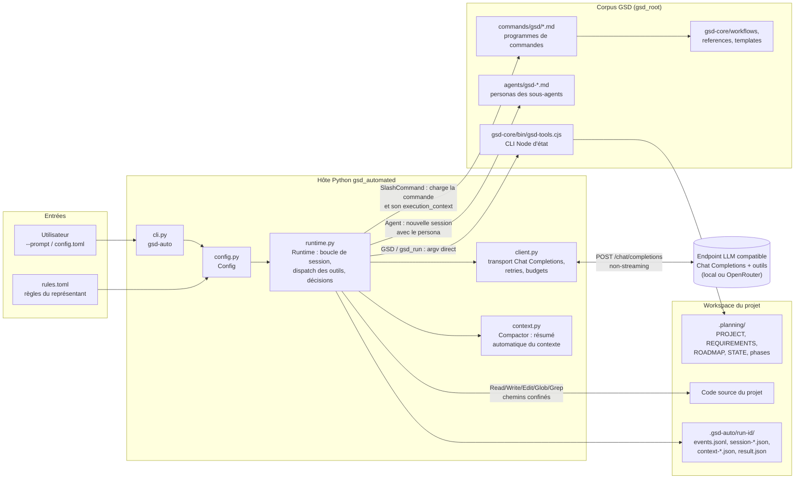
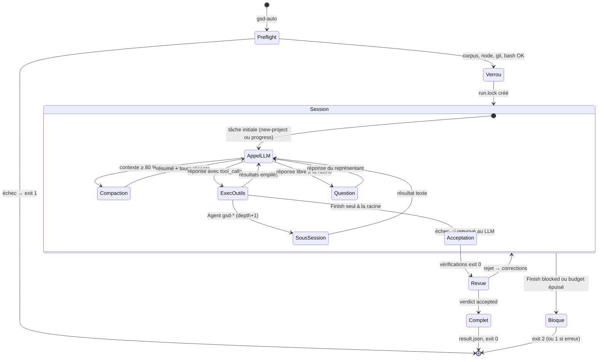
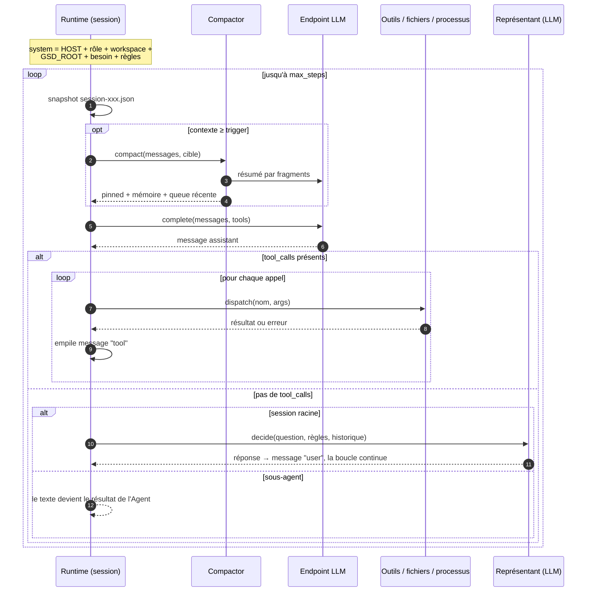
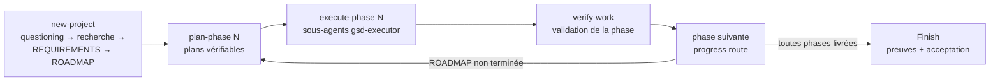

# Architecture et principe de fonctionnement de l'automate GSD

Ce document décrit le fonctionnement interne de `gsd-automated`, l'hôte Python
autonome qui exécute les workflows GSD (Git. Ship. Done.) sans intervention
humaine. Il complète [AUTOMATION.md](AUTOMATION.md), qui couvre l'installation
et la configuration.

## Idée directrice

L'automate repose sur une inversion des rôles :

- **Le corpus GSD est le programme.** Les fichiers `commands/gsd/*.md`,
  `gsd-core/workflows/*` et `agents/gsd-*.md` décrivent les procédures :
  initialisation, planification, exécution de phases, vérification.
- **Le LLM est l'interpréteur.** Il lit ces documents et les exécute, comme le
  ferait Claude Code ou un autre hôte interactif.
- **Le package Python est l'hôte.** Il fournit au LLM des outils réels (fichiers,
  shell, CLI Node GSD, sous-agents), fait respecter les limites (budgets,
  profondeur, chemins autorisés) et remplace l'humain aux points de décision.

Aucun workflow n'est réécrit en Python : la logique métier reste dans les
documents GSD, ce qui garantit que l'automate suit le même processus que les
hôtes interactifs.

## Vue d'ensemble

## Démarrage d'un run

`gsd-auto --config config.toml` enchaîne les étapes suivantes :

1. **Configuration** (`Config.load`) : lecture TOML/JSON, résolution des chemins
   relativement au fichier de config, validation des budgets et des ratios de
   compaction, sélection de la variable de clé (`OPENROUTER_API_KEY` choisi
   automatiquement sur l'hôte openrouter.ai).
2. **Verrou exclusif** : création atomique de `.gsd-auto/run.lock` (PID). Un
   seul run par projet ; le verrou n'est jamais volé automatiquement.
3. **Preflight** : le workspace existe, le corpus GSD contient les fichiers
   requis, `node`, le shell et `git` sont présents, `gsd-tools.cjs
   runtime-identity` répond, le shell exécute `gsd_run`.
4. **Reprise éventuelle** (`--resume`) : les décisions des runs précédents
   portant le même besoin sont rechargées depuis `events.jsonl`, et les chemins
   des checkpoints `session-*.json` sont fournis au LLM comme données
   historiques — jamais comme commandes à rejouer.
5. **Choix du point d'entrée** : `progress` si `.planning/ROADMAP.md` existe,
   sinon `new-project`. Le contenu de la commande, ses `execution_context` et
   les instructions projet (`AGENTS.md`, `CLAUDE.md`) composent la tâche
   initiale.
6. **Session racine** : boucle outil/appel jusqu'à `Finish`, blocage ou
   épuisement des budgets.

## La boucle de session : cœur de l'automate

`Runtime.session()` est une boucle *modèle → outils → modèle* identique pour la
racine et les sous-agents. Chaque session possède son propre historique de
messages, son identifiant et son budget d'étapes (`max_steps`).

Deux propriétés importantes de cette boucle :

- **Une réponse en prose ne termine jamais le run.** À la racine, elle est
  convertie en question pour le représentant automatique, dont la réponse est
  réinjectée comme message utilisateur. Seul `Finish` termine.
- **Les sous-agents sont synchrones.** L'outil `Agent` ouvre une session fille
  complète (mêmes outils sauf `Finish`, profondeur + 1, limite `max_depth`),
  attend son texte final et le retourne comme résultat d'outil. Les « vagues
  parallèles » des workflows s'exécutent séquentiellement.

## Les outils exposés au LLM

| Outil | Rôle | Garde-fous |
|---|---|---|
| `Read` | Lecture paginée en caractères | Chemins limités au workspace et au corpus |
| `Write` / `Edit` | Écriture, remplacement à occurrence unique | Écriture limitée au workspace |
| `Glob` / `Grep` | Exploration littérale du projet | Exclut `.git`, `node_modules`, `.gsd-auto`, `.venv` |
| `Bash` | Shell neuf à chaque appel, `gsd_run` injecté | stdin fermé, timeout, arbre de processus tué |
| `GSD` | `node gsd-tools.cjs <argv>` sans shell | État GSD réel (`.planning/`) |
| `SlashCommand` | Charge `commands/gsd/<nom>.md` + `execution_context` | Nom validé `[a-z0-9-]+` |
| `Agent` | Sous-session synchrone avec `agents/gsd-*.md` | `max_depth` = 3 |
| `AskUserQuestion` | Question → règles `answers` puis LLM représentant | Jamais d'attente humaine |
| `Finish` | Racine uniquement : demande de clôture | Acceptation + revue indépendante |

Les chemins de type `~/.claude/gsd-core/...` présents dans les documents sont
remappés vers `gsd_root`, ce qui rend le corpus Claude-orienté exécutable sans
installation Claude.

## Remplacer l'humain : le représentant automatique

Chaque point de décision (`AskUserQuestion`, portes d'approbation des
workflows, réponses libres de l'hôte) est routé vers `Runtime.decide()` :

1. Les règles `[[answers]]` sont essayées dans l'ordre : première sous-chaîne
   `contains` trouvée (insensible à la casse) dans la question sérialisée.
2. À défaut, un LLM « représentant » reçoit en contexte le besoin initial, les
   instructions de `rules.toml`, toutes les décisions déjà prises et les
   derniers échanges. Il doit répondre en texte — les appels d'outils sont
   refusés.
3. La décision (question, réponse, source `rule`/`llm`) est journalisée et
   rejouée en cas de `--resume`.

## Clôture : preuves puis revue indépendante

`Finish(status=complete)` n'est pas accepté sur parole :

1. Les fichiers `evidence` doivent exister dans le workspace et sont relus sur
   disque.
2. Toutes les `verification_commands` configurées sont exécutées ; un seul
   échec ou timeout renvoie le LLM corriger.
3. Une **revue LLM distincte** compare besoin, règles, résumé, preuves et
   résultats des commandes, puis rend un verdict JSON `{"accepted": bool}`.
   Un rejet est renvoyé à la session pour correction.

`Finish(status=blocked)` produit `result.json` et le code de sortie `2`.

## Les cinq rôles LLM

Un même endpoint peut héberger plusieurs rôles, chacun configurable :

| Rôle | Déclenché par | Modèle |
|---|---|---|
| Hôte racine | `session(depth=0)` | `llm.model` |
| Sous-agent `gsd-*` | outil `Agent` | `llm.agent_models.<agent>` sinon `model` |
| Représentant | `AskUserQuestion`, prose racine, revue de clôture | `llm.decision_model` sinon `model` |
| Résumeur | compaction | modèle du rôle courant |

## Robustesse

- **Coupures réseau** (`client.py`) : la même requête est réémise — jamais de
  rejeu d'outil. Retries sur erreurs de transport, 408, 429, 500/502/503/504
  et erreurs
  fournisseur relayées dans un HTTP 200 ; backoff 1→30 s, `Retry-After`
  respecté, plafonds `reconnect_attempts` (30) et `reconnect_timeout` (900 s).
  401/403 et réponses invalides arrêtent le run. Le transport non-streaming
  garantit qu'aucune réponse tronquée n'exécute un outil.
- **Fenêtre de contexte** (`context.py`) : mesure en caractères, indépendante
  du tokenizer. À `compact_trigger_ratio` (80 %) du budget, les tours anciens
  sont archivés dans `context-*.json` puis résumés par fragments en un handoff
  borné ; le contexte reconstruit garde les messages système, la mémoire
  résumée et les tours récents entiers — un appel d'outil n'est jamais séparé
  de son résultat. Si le fournisseur refuse malgré tout
  (`context_length_exceeded`), compaction supplémentaire et 3 réessais.
- **Traçabilité** : `events.jsonl` (décisions, outils, compactions, revues),
  `session-*.json` avant chaque appel, `result.json` final. La clé API est
  masquée dans les journaux et retirée de l'environnement des sous-processus.

## Ce que fait le LLM à l'intérieur de la boucle

Le découpage du travail n'est pas codé en Python : il est lu dans les documents
GSD. Le cycle type suivi par l'hôte pour un nouveau projet :

Chaque étape est une `SlashCommand` dont le document charge à son tour
workflows, références et templates. L'état persistant vit dans `.planning/` et
est manipulé par le vrai `gsd-tools.cjs` : si le processus Python est relancé,
`progress` retrouve la roadmap et reprend le routage.

## Limites assumées

- Pas de parallélisme ni de worktrees : les vagues de sous-agents sont
  séquentielles.
- Hooks Claude/Kilo/Cline, MCP et intégrations IDE ne sont pas réimplémentés ;
  une capacité indispensable absente doit produire un blocage, pas une
  invention de résultat.
- Le shell est une exécution locale avec les droits du processus : les règles
  guident le LLM, elles ne sont pas une politique de sécurité OS.
- La revue finale est une appréciation LLM ; les critères mesurables doivent
  passer par `verification_commands`.
